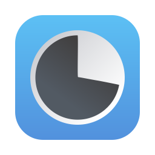

<h1 align="center">KnotClock</h1>

A very customizable Countdowns / Reminders app for macOS and iOS that can do Daily, Weekly and Single countdowns.

---

# Requirements
macOS 13.0+

iOS/iPadOS 16.0+

# Installation guide for iOS/iPadOS
While application is ready for iOS/iPadOS (in addition to macOS), as it is not released on the App Store you will need to manually install it on your device using Xcode.

I will include a guide here later on.

# Screenshots
</img> </img> </img> </img> </img> </img> 
